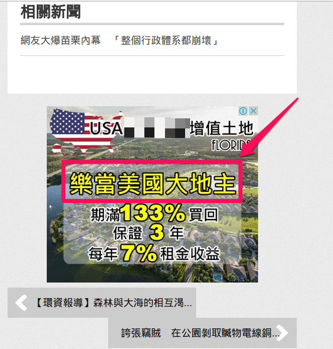

<style>
.reveal pre code {
  background:white;
  color: black;
}


.reveal pre code span {
  color: black;
  font-weight: normal;
}

.variable{
  color: gray;
}

.lang-r + pre {
    ont-size: 36px;
    ont-size: 36px;
    font-size: 18px;

}


strong {
font-weight:bolder;
}

div.hidecode + pre + pre {display: none}
</style>
<script>
doclick=function(e){
  var elem = e.nextSibling.nextSibling.nextSibling.nextSibling;
  if(elem.style.display=="none"){
    elem.style.display="block";
  }else{
    elem.style.display="none";
  }
}
</script>

<style>
h2 {
  font-size: 40px;
  color: blue;
}
span {
  font-size: 20px;
}
</style>


## R: A Brief Introduction

- 1976 貝爾實驗室 John Chambers,Rick Becker,Allan Wilks 研發 S 語言
- 1993 Ross Ihaka and Robert Gentlemen (University of Auckland, New Zealand) 研發 R 語言  
- R 語言是一種基於 S 語言所發展出具備統計分析, 繪圖與資料視覺化的程式語言  
- 1997 R 的核心開發團隊 (R development core team) 成立, 專責 R 原始碼的修改與編寫 

---

[Companies Using R](http://www.revolutionanalytics.com/companies-using-r)

<iframe src="http://www.revolutionanalytics.com/companies-using-r" align='middle'></iframe>

---


讓我們用R先來玩個資料吧～～



---

- 你沒看錯，今天其實是投資說明會，教你買地!
- R 有很多套件，裡面會有很多內建的資料集可以使用。
- 這次我們要使用的是 `MASS` 這個套件中的 `Boston` 資料集。

---


如果你還沒下載R Script  
請將[RScript](https://github.com/agogomei01/DSC2015_RBasic/blob/master/slides/RBasic1.R) 複製

---

```{r,eval=TRUE}
library(MASS)
#介紹引入套件
data(Boston)
Boston=subset(Boston,,-c(zn,chas,black,rad,ptratio,age,nox,tax))
#刪減欄位
```
<br>
<br>
<br>
<br>  
<div class="variable">
* 引入套件  
    + library(套件名稱)  
* 引入套件中的資料集  
    + data(資料集名稱) 

</div>


## 如何看資料

- `head` 會列出前 6 筆資料。

<div class="hidecode" onclick="doclick(this);">[Show]</div>
```{r}
head(Boston)
```


## Boston Dataset有哪些Variables

Column Name | 中文 | Column Name | 中文
- | - | - | -
crim | 犯罪率 | rm | 該鎮平均每戶的房間數目
dis | 離公司距離 | indus | 商業區比例
lstat | lower status of the population (percent).低收入戶比例 | medv | 自有住宅房價中位數


---

<p style="font-size:36px">你也可以使用 </p> 
<p style="font-size:36px">
head(),  
tail(),  
summary(),  
str()</p>


## 如何看資料- 好用的summary()

```{r}
summary(Boston)
```


---

Column Name | 中文 | Column Name | 中文
- | - | - | -
crim | 該鎮犯罪率 | indus | 該鎮商業區率

<bar>

```{r,echo=FALSE}
library(knitr)
kable(summary(Boston[c("crim", "indus")]))
```
犯罪率88.9%??


---

Column Name | 中文 | Column Name | 中文
- | - | - | -
rm | 該鎮平均每戶的房間數目 | dis | 該鎮離公司距離

<bar>

```{r,echo=FALSE}

kable(summary(Boston[,c("rm", "dis")]))
```

---

Column Name | 中文 | Column Name | 中文
- | - | - | -
lstat | 該鎮低收入戶比例 | medv | 該鎮住宅房價中位數

<bar>

```{r,echo=FALSE}

kable(summary(Boston[,c("lstat", "medv")]))
```

---

<p style="font-size:36px">
哪些因素(欄位)影響房價??</p>

## 尋找相關性 cor()
```{r}
#解釋1非常正相關 -1是非常負相關
cor(Boston$medv,Boston)
```
<br>
<br>
<br>
<div class="variable">
關聯性
cor(x, y)
</div>

---

可以用圖來看各欄位跟房價之間的關聯度

```{r}
barplot(cor(Boston$medv,Boston))

```
<br>
<br>
<br>
<div class="variable">
長條圖
barplot()
</div>


---

<p style="font-size:36px">
我們可以知道...</p>

房價與 **該鎮平均房間數** 是 **正相關** ,與 **該鎮平均低收入戶比例** 是 **負相關** 

---

<p style="font-size:36px">
房間數跟房價關係<p/>

```{r, echo=FALSE}
plot(Boston$rm,Boston$medv)
#x軸為房間數 y軸為房價
LM=lm(Boston$medv~Boston$rm)
#找出線性關係
abline(LM,col=2)
#畫出圖
```

<div class="variable">
畫圖 
plot(x,y)  
線性模型(二元一次方程式,線性迴歸....)
lm(y~x)  
在plot上加直線  
abline(x,col=)
</div>


## 小練習 房間數與房價的關係

<br>
<br>
<br>
<br>
參考程式碼
```{r, eval=FALSE}
plot(Boston$rm,Boston$medv)
#x軸為房間數 y軸為房價
LM=lm(Boston$medv~Boston$rm)
#找出線性關係
abline(LM,col=2)
#畫出圖
```


---

 <p style="font-size:36px"> 現在我們知道 <p/>

- 相關性 cor() -> 房價跟房間數正相關,低收入戶多寡負相關
- plot(), barplot() -> 我們還會畫圖

---

 <p style="font-size:72px">
都能出國買房,買地  
要買就是要買最好的 最貴的
<p/>

## 我要怎定義豪宅

找出前 5% (10%) 的房價

```{r}
quantile(Boston$medv, probs = c(0.95, 0.9))
```
<br>
<br>
<br>
<div class="variable">
百分位數點
quantile(x, probs=)
</div>


---

<p style="font-size:36px"> 房價分布圖</p>

- 使用 `hist` 做出房價的柱狀圖。

```{r}
hist(Boston$medv,breaks=20)
```
<br>
<br>
<br>
<div class="variable">
柱狀圖
hist(x,breaks= )
breaks:分成幾類

</div>


---

<p style="font-size:36px"> 房價分布圖</p>

- 使用 `abline` 標示出剛剛計算的前 5% 高的房價位置。

```{r}
hist(Boston$medv, breaks = 20)
abline(v = 43.4, col="red")
```
<br>
<br>
<br>
<div class="variable">
柱狀圖
hist(x,breaks= )
breaks:分成幾類

在plot上加直線
abline(x,col=)
</div>
---

<p style="font-size:36px"> 高房價與其他是否有差異</p>

- 前 5% 的房子的各項平均與其他房子是否有差異?
- 用 R 簡單計算來看看!

---

<p style="font-size:36px"> 平均-高房價與其他是否有差異</p>

- 使用 `subset` 做分群。

```{r}
MEDVhight = subset(Boston,Boston$medv>=43.4)
MEDVOther = subset(Boston,Boston$medv< 43.4)
# MEDVhight 為房價高的資料
# MEDVOther 其他資料
```
<br>
<br>
<br>
<div class="variable">
選取資料
subset(x,condition)
</div>
---

<p style="font-size:36px"> 平均-高房價與其他是否有差異</p>

- 使用 `colMeans` 計算各欄位平均。

```{r}
colMeans(MEDVhight)
```

```{r}
colMeans(MEDVOther)
```
<br>
<br>
<br>
<div class="variable">
欄平均
colMeans()
</div>
---

- 使用 `rbind` 合併資料表。

```{r}
rbind(colMeans(MEDVhight),colMeans(MEDVOther))
```

高房價的鎮 犯罪率較低 工業區較少 住宅區比例高
<br>
<br>
<br>
<div class="variable">
Row Bind  
rbind(row1,row2)
</div>


---

<p style="font-size:36px"> 我們現在知道～～<p/>

1. 平均數 rbind->高房價的鎮 犯罪率較低 工業區較少 住宅區比例高  
2. 相關性 -> 房價跟房間數正相關,低收入戶多寡負相關   

## 高房價的鎮 該鎮低收入戶多寡

我們可以嘗試將低收入戶分類

<div class="hidecode" onclick="doclick(this);">[Show]</div>
```{r}
Boston2=Boston
Boston2$Income=cut(Boston2$lstat,breaks=3)
#將低收入戶比例分成三類別
Boston2$Income
```

---

<p style="font-size:36px">
也可以用文字標記</p> 

H: 該鎮低收入戶比例 < 13.8%  
M: 該鎮低收入戶比例 13.8%~25.9%  
L: 該鎮低收入戶比例 >25.9%

<div class="hidecode" onclick="doclick(this);">[Show]</div>
```{r}
Boston2$Income= cut(Boston2$lstat,breaks=3,labels=c("H","M","L"))
```


---

<p style="font-size:36px">我可以計算有多少"H"嗎?</p>

H: 該鎮低收入戶比例 < 13.8%  
M: 該鎮低收入戶比例 13.8%~25.9%  
L: 該鎮低收入戶比例 >25.9%  
<div class="hidecode" onclick="doclick(this);">[Show]</div>
```{r}
table(Boston2$Income)
```
<br>
<br>
<div class="variable">
各欄位加總
table()
</div>


---

<p style="font-size:72px">Let's Play Swirl</p>


## 我們來回顧剛剛研究的dataset

```{r}
str(Boston2)
```


# R 與資料測量尺度

---

統計上資料測量的尺度分為以下幾種:

- 名目資料(nomial)
- 順序資料(ordinal)
- 區間資料(interval)
- 比例資料(ratio)


## 名目資料

- 數值只用於記號，**"值"**毫無意義的數據  
    - 性別
    - 國家/班級

| 男 | 女 |
|----|----|
| 0  |  1 |

|男 | 女 |
|---|----|
| 1 | 2  |

## 順序資料

- 數值有順序關係，但是差距沒有意義  
    - 名次  
    - 排序表  

第一名的成績一定比第二名好, 但不代表第一名比第二名好兩倍


## 區間資料

- 有差距的概念，沒有倍數的概念。  
- 數值有1的概念，沒有0的概念。可加減。  
    - 溫度  
    - 時間

## 比值資料

- 同時有差距和倍數的概念。 
- 可加減乘除。 
    - 使用者人數  
    - 營收


---

| 資料衡量尺度 | 變數形態 |   特性   |     範例    |
|--------------|----------|----------|--------------|
|   名目資料   |   質性   |   類別   | 性別、縣市、國家 |
|   順序資料   |   質性   | 優先順序 |     名次     |
|   區間資料   |   量性   | 大小距離 |  溫度、時間  |
|   比例資料   |   量性   |   比值   |  營收、GDP   |


# R 的基本資料結構

---

<p style="font-size:36px">R 的基本資料結構
與統計測量尺度有密切的關係</p>

---

R 的基本資料結構與統計測量尺度對應關係

| 測量尺度 | 變數形態 | 資料結構 |
|----------|----------|----------|
| 名目資料 |   質性   |  Factor  |
| 順序資料 |   質性   |  Factor  |
| 區間資料 |   量性   |  Vector  |
| 比例資料 |   量性   |  Vector  |

## Vector in R

<div align='center'>
  
</div>


## Vector in R

<div align='center'>
  
</div>
<br/>

- 可以使用 `c` 這個內建函數建立向量

```{r, cache=TRUE}
x = c(1, 2)
```

---

<p style="font-size:36px"> 範例: 12月份 </p>

```{r vector, cache=TRUE}
Month1=c(1,2,3,4,5,6,7,8,9,10,11,12)
Month2=1:12 # 建立連續向量的簡易寫法
```


<p style="font-size:36px"> 練習一下 </p>

- 用剛剛學會的 `c` 來建立兩個向量, `taipei_temp` 跟 `hengchun_temp` 紀錄兩地氣溫。

台北恆春每月平均溫度

|月份|   1  |   2  |   3  |   4  |   5  |   6  |   7  |   8  |   9  |  10  |  11  |  12  |
|----|------|------|------|------|------|------|------|------|------|------|------|------| 
|台北| 16.1 | 16.5 | 18.5 | 21.9 | 25.2 |	27.7 | 29.6 |	29.2 | 27.4 | 24.5 | 21.5 |	17.9 |
|恆春| 20.7 | 21.4 | 23.2 |	25.2 | 27.0 |	27.9 | 28.4 |	28.1 | 27.4 |	26.3 | 24.3 |	21.7 |

## 練習一下

```{r Temperature, cache=TRUE}
taipei_temp = c(16.1, 16.5, 18.5, 21.9,	25.2, 27.7,	29.6,	29.2, 27.4, 
            24.5, 21.5,	17.9)
hengchun_temp = c(20.7, 21.4, 23.2, 25.2,	27.0,	27.9,	28.4,	28.1,	27.4,	
              26.3,	24.3,	21.7)
```

---

<p style="font-size:36px">加上月份名</p>

```{r, cache=TRUE, results='hold'}
names(taipei_temp) = Month1
names(hengchun_temp) = Month2
taipei_temp
hengchun_temp
```


## Element-by-Element Operation

```{r, cache=TRUE, results='hold'}
c(1, 2, 3) + c(3, 2, 1)
```


## Element-by-Element Operation

```{r, cache=TRUE, results='hold'}
c(1, 2, 3) + 1
```

## Element-by-Element Operation

```{r, cache=TRUE, results='hold'}
c(1, 2, 3) + 1
```


## Element-by-Element Operation

```{r, cache=TRUE, results='hold'}
c(1, 2, 3) + 1
```


## 猜猜看

```{r, cache=TRUE, results='hide'}
guess <- c(1:10) + c(1:2)
```

- `guess` 會是多少呢?

## 猜猜看

```{r, cache=TRUE, results='hide'}
guess <- c(1:10) + c(2, 4)
```

- `guess` 會是多少呢?

```{r, results='hold'}
guess
```


## 練習看看

```{r, echo=TRUE, cache=TRUE}
1:3 * 2
```

## 向量的同質性

Character > Numeric > Logical

```{r, cache=TRUE}
x <- c(1, 2, "3")
class(x)
x
```

## 向量的同質性

Character > Numeric  > Logical

```{r, cache=TRUE}
x <- c(1, 2, "3")
class(x)
x
```

- 向量中的所有元素都必須是同一種型別。


## 練習一下 向量

台北恆春每月平均溫度

月份 | 1 | 2 | 3 | 4 | 5 | 6 | 7 | 8 | 9 | 10 | 11 | 12 
- |- | - | - | - | - | - | - | - | - | - | - | - 
台北 | 16.1 | 16.5 |  18.5 |  21.9 |  25.2 |  27.7 |  29.6 |  29.2 |	27.4 | 24.5 |	21.5 |	17.9
恆春 | 20.7 | 21.4 | 23.2 |	25.2 |	27.0 |	27.9 |	28.4 |	28.1 |	27.4 |	26.3 |	24.3 |	21.7

---

```{r Temp}
TaipeiTem=c(16.1,16.5,18.5 ,	21.9 ,	25.2 ,	27.7 ,	29.6 ,	29.2,27.4,24.5 ,	21.5 ,	17.9)
HengchunTem=c(20.7 , 21.4 , 23.2 ,  25.2 ,	27.0 ,	27.9 ,	28.4 ,	28.1 ,	27.4 ,	26.3 ,	24.3 ,	21.7)
```


---

R 的基本資料結構與剛剛所提到的測量尺度有密切的關係

| 測量尺度 | 變數形態 | 資料結構 |
|----------|----------|----------|
| 名目資料 |   質性   |  Factor  |
| 順序資料 |   質性   |  Factor  |
| 區間資料 |   量性   |  Vector  |
| 比例資料 |   量性   |  Vector  |


## Factor(常用於處理質性)

如何處理名目變數?
```{r factor and Vector}
x <- c("F","M","F","F")
x
x <- factor(c("F","M","F","F"), levels=c("F","M"))
x
as.integer(x)
```

---

```{r factor NA Message}
levels(x)
x <- factor(c("F","M","F","F"), levels=c("F"))
levels(x)
```

---

### 如何處理順序資料?

```{r factor-levels ordinal}
#農業社會 男尊女卑
Argri <- factor(c("F","M","F","F"),order=TRUE,levels=c("F","M"))

#阿美族 女尊男卑
Amis <- factor(c("F","M","F","F"),order=FALSE,levels=c("F","M"))

#應該要用
Amis <- factor(c("F","M","F","F"),order=TRUE,levels=c("M","F"))
```


---

舉一個認真的例子 - 班上一號到六號分別拿到A,B,C的級別
```{r}

rank=factor(c("C","A","B","B","C","C"),order=TRUE,level=c("C","B","A"))
rank
rank[1]<rank[2]

```


---
<p style="font-size:36px">
Recap</p>

同質性資料
<br>

| 資料衡量尺度 | 變數形態 | 資料結構 |   特性   |     範例         |
|--------------|----------|----------|----------|----------------- |
|   名目資料   |   質性   |  Factor  |   類別   | 性別、縣市、國家 |
|   順序資料   |   質性   |  Factor  | 優先順序 |     名次         |
|   區間資料   |   量性   |  Vector  | 大小距離 |  溫度、時間      |
|   比例資料   |   量性   |  Vector  |   比值   |  營收、GDP       |


## Character

- 最廣泛的資料結構，可用於處理文字相關的工作，如：設定圖片的標題
- 輸入的時候利用`"`或`'`來包覆要輸入的文字

---

<p style="font-size:36px">常用的Character處理函數</p>

字串的剪接：`paste`
```{r}
x <- "abc";y <- "dbbbe"
paste(x, y, sep=",")
```

字串的切割：`strsplit`
```{r}
strsplit(x, "b")
```

---

截取子字串：`substring`
```{r}
name1<-"郭雪芙"
substring(name1, 1, 1)
```


## 來個小練習 先從向量開始

輸入蔡依林的基本資料:  
age:34  
height:158
weight:40

```{r}
Jolin = c(age=34,height=158,weight=40)
Jolin
```

---

請你幫我加上Jolin 是台北人,女性的資料  
Location:"Taipei"      
Gender:"F"  
```{r}
Jolin = c(age=34,height=158,weight=40,Location="Taipei",Gender="F")
Jolin
```

---

<p style="font-size:36px"> 有注意到資料都變成 字串(character) </p>


# R 如何處理異質性資料?

---


### 異質性資料 List 

```{r}
x<-list(1,2,"3")
```

---

<p style="font-size:36px"> 剛才的Jolin資料  
全部都是字串("") </p>

```{r}
Jolin = c(age=34,height=158,weight=40,Location="Taipei",Gender="F")
Jolin
```


## 小練習 List

請問蔡依林的基本資料,要怎儲存成異質性資料?

---

答案

```{r}
#答案
Jolin = list(age=34,height=158,weight=40,Location="Taipei",Gender="F")
Jolin
```


## 異質性資料 dataframe

View(Boston)


---

<p style="font-size:36px">DataFrame呈現</p>


---

<p style="font-size:36px"> DataFrame Row的概念</p>


---

<p style="font-size:36px"> DataFrame Column的概念


---

<p style="font-size:36px"> Ways to add a column</p>

Boston$Income<-    
Boston[["Income"]]<-  

---

<p style="font-size:36px"> Ways to remove the column </p>

Boston$Income<-NULL  
Boston[["Income"]]<-NULL

---

<p style="font-size:36px"> rbind </p>


```{r,warning=FALSE}
Serial=c(1,2,3)
RBasicTeacher=c("Dboy", "Ning", "Noha")
RBasicRbind=rbind(Serial,RBasicTeacher)
```

---

<p style="font-size:36px">cbind</p>
```{r}
Serial=c(1,2,3)
RBasicTeacher=c("Dboy", "Ning", "Noha")
RBasicCbind=cbind(Serial,RBasicTeacher)
RBasic=cbind(c(1,2,3),c("Dboy", "Ning", "Noha"))
```


## summary 指令

- 根據資料形態的不同，函數的輸出結果也會不同

---

<p style="font-size:36px"> Factor</p>

```{r}
factor_example=factor(c("三年甲班", "三年乙班", "三年甲班"))
summary(factor_example)
```
三年乙班 三年甲班 
1        2 

---

<p style="font-size:36px"> Character</p>

```{r}
character_example=c("a","b","c")
summary(character_example)
```
Length     Class      Mode 
3       character   character 

---

<p style="font-size:36px"> List </p>

```{r}
list_example <- list(1L, 2.0, "3")
summary(list_example)
```
Length Class  Mode     
[1,] 1      -none- numeric  
[2,] 1      -none- numeric  
[3,] 1      -none- character


# 資料的選取

## 向量的選取

---

<p style="font-size:36px"> 坐標 </p>

```{r index, echo = TRUE}
x <- 1:5
x[2:3]
```

---

<p style="font-size:36px"> 布林 </p>

```{r boolean_selection, echo = TRUE}
x <- 1:5
x > 3
x[x > 3]
```


## 小挑戰選取台北恆春天氣資料

先印出台北跟恆春每個月平均溫度
```{r}
TaipeiTem
HengchunTem
```

---

<p style="font-size:36px"> 分別選取出兩地溫度>20度的月份</p>

- "> <"
```{r}
TaipeiTem>20
TaipeiHotMonths = TaipeiTem[TaipeiTem>20]
```
- True & False
```{r}
SelectMonth= HengchunTem>20
HengchunHotMonths = HengchunTem[SelectMonth==TRUE]
```

---

<p style="font-size:36px"> 找出夏天(七八九月)平均溫度</p>
```{r}
 TaipeiTem[7:9]
mean(TaipeiTem[7:9])
HengchunTem[7:9]
mean(HengchunTem[7:9])
```

---

<p style="font-size:36px"> 找出冬天(十二,一,二月)平均溫度</p>
```{r,error=FALSE}
# TaipeiTem[1,2,12]
mean(TaipeiTem[c(1,2,12)])
mean(HengchunTem[c(1,2,12)])
```

---

<p style="font-size:36px"> 表格的選取</p>

```{r select_table, echo = TRUE}
TemTable=rbind(TaipeiTem,HengchunTem)
TemTable
#選取台北二月的溫度
TemTable[1,2]
#選取二月的溫度
TemTable[,2]
TemTable[1,]

```

---

<p style="font-size:36px"> 欄的選取</p>

```{r select_column, echo = TRUE}
head(Boston)
head(Boston[["crim"]]) # head(Boston$crim)
```


## 轉換資料結構 

`as`

- `as.character`
- `as.logical`
- `as.integer`
- `as.numeric`

---

```{r as}
as.numeric("2")
as.integer("a")
```

```{r as.character, echo = TRUE}
x <- c(1, 2, 3, 2, 3, 2, 1)
as.character(x) # 字串
factor(x) 
```

---

<p style="font-size:36px"> 直接轉換</p>

```{r as.numeric, echo = TRUE}
x <- c("1", "2", "3", "2", "a")
as.numeric(x)
```

- `NA`代表Not available，代表著**missing value**


## 補充資料


- [Swirl Courses](https://github.com/swirldev/swirl_courses)  
- [Introduction to R](https://www.datacamp.com/courses/free-introduction-to-r) (around 4 hours) 
- [Cookbook for R](http://www.cookbook-r.com/)

## Acknowlege

- Wush


---

- 智程


---

- Dboy


