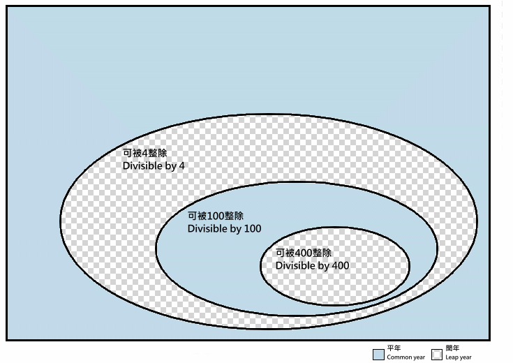
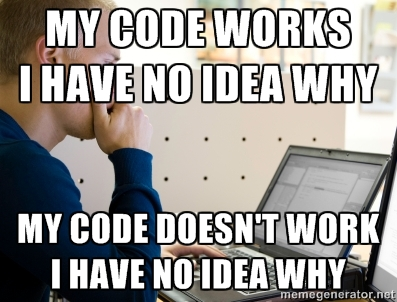
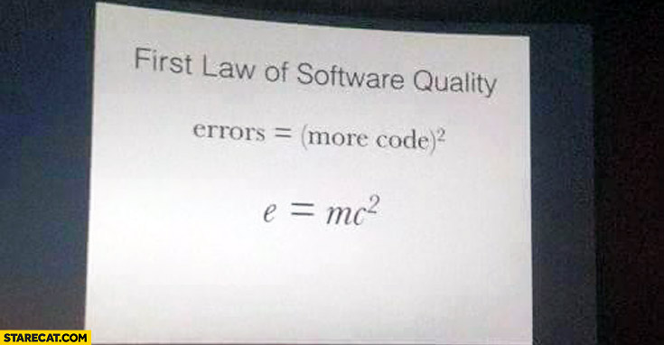
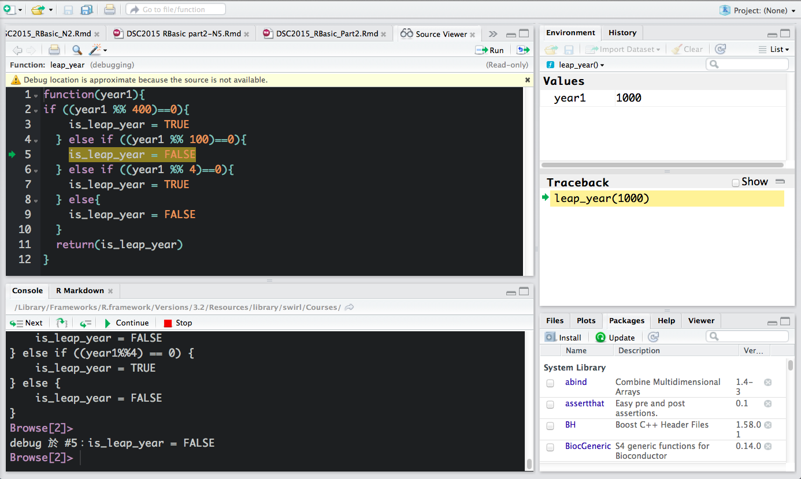
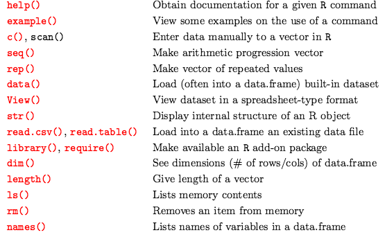
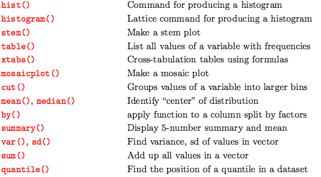

```{r, echo=FALSE, message=FALSE}
#library(swirl)
rm(list=ls())
```
## Taiwan R User Group / MLDM Monday 
<font size="7">
http://www.meetup.com/Taiwan-R
</font>
<center></center>


<!--######################################################################################-->
# Function / Program in R
<!--######################################################################################-->


## Program：

<br><br><br>
<font size="7">
Programs = <br><br><br>
Algorithms ＋ Data Structures<br><br>
 <br><br><br>
                             by Niklaus Wirth, 1976
</font>
<br><br><br>
<https://en.wikipedia.org/wiki/Algorithms_%2B_Data_Structures_%3D_Programs>

## 程式：

<br><br><br>
<font size="7">
程式 =<br><br><br>
演算法    ＋    資料    <br><br>
 <br><br><br><br>
							by 尼克勞斯·維爾特, 1976
</font>
<br><br><br>
<https://zh.wikipedia.org/zh-tw/%E5%B0%BC%E5%85%8B%E5%8A%B3%E6%96%AF%C2%B7%E7%BB%B4%E5%B0%94%E7%89%B9>

## 資料 or 資料結構
<br><br><br><br>
<font size="7">
Data Structure: <br><br><br>
剛剛上一位講者： Ning 已經教過了，<br><br>
別忘了要記得用swirl()複習喔！
</font>


## 什麼叫程式
<br><br><br><br>
<font size="7">
目的是用來處理「特定資料」，<br><br>
根據演算法將多個函式或是指令組成的集合<br><br>
</font>
<font size="4">
<br><br><br>
簡單說，寫一個程式，其實和 寫一段文章，或是一篇小說差不多， 
</font>

<!--
## 葉丙成老師的BJT Online
<center></center>
<center><div> <http://www.slideshare.net/rhonda1305/20140510-1> </div></center>

## 柏拉圖有一天問蘇格拉底：什麼是愛情？
<center></center>

## but...
<br>
<font size='6'> 今天不是來教大家學英文，<br><br>
也不是來講機率或翻轉教育課程，<br><br>
所以下面還是來學R吧</font>

-->


## Function 或 演算法
<br><br><br>
<pre class='prettyprint lang-r'>
<font size="8">
數學上叫函數，<br><br>
程式語言中叫函式
</font>
</pre>


## 為什麼要用function：
<br>
<pre class='prettyprint lang-r'>
<font size="9">
1. 可以把「相同目的」的"指令"和"資料"
　整理在一起


2. 可重複使用


3. "可方便閱讀程式"
</font>
</pre>
<br>
<font size="3">
by 民明書房 Noah
</font>

## function的說明：
### 可用R來查詢定義：
<br>
<pre class='prettyprint lang-r'>
<font size="9">

?function(){}

</font>
</pre>

## 用法：
<br><br>
<pre class='prettyprint lang-r'>
<font size="9">
函式名稱 = function(引數) {

　　　　程式的內容........

}
</font>
</pre>
<font size="5">
引數：表示可以把資料從function外面引導到function裏面的橋樑，<br>
引數不一定要給<br><br>
</font>
提醒：愛護生命，建議千萬不要用中文當作變數及函式名字，現在用中文只是為了說明

## function的使用方法：
<br><br>
<pre class='prettyprint lang-r'>
<font size="9">

　　　　函式名稱()

</font>
</pre>
再次提醒：家人朋友都很愛你，別想不開用中文當作變數及函式名字


## 顯示 Hello World
<br><br>
<pre class='prettyprint lang-r'>
<font size="9">
請在R 中顯示：Hello World, R
</font>
</pre>

## 方法：
<pre class='prettyprint lang-r'>
<font size="7">
　　"Hello World, R"<br><br>
　　print("Hello World, R")<br><br>
　　paste("Hello World, R")<br><br>
</font>
</pre>

## 選擇print()
<br><br><br>
<pre class='prettyprint lang-r'>
<font size="9">
　　print("Hello World, R")
</font>
</pre>

## function的製作方法：
<br><br>
<pre class='prettyprint lang-r'>
<font size="9">
函式名稱 = function(引數) {

　　　程式的內容........

}
</font>
</pre>


## function的製作方法：
<br><br>
<pre class='prettyprint lang-r'>
<font size="9">
函式名稱 = function(引數) {

　　print("Hello World, R")

}
</font>
</pre>
再次提醒：愛護生命，千萬不要用中文當作變數及函式名字


## Hello World
### 第一個R的程式：
<pre class='prettyprint lang-r'>
<font size="9">
helloworld <- function(){

　　print("Hello World, R")

}

helloworld()
</font>
</pre>
```{r, echo=FALSE, message=FALSE}
helloworld <- function(){
　　print("Hello World, R")
}
helloworld()
```

## 範例：可以用引數帶入資料變數
<pre class='prettyprint lang-r'>
<font size="6">
hi <- function(your_friend_name){

  print(paste("Hi ", your_friends_name))
}
</font>
</pre>
執行：
<pre class='prettyprint lang-r'>
<font size="6">
hi("Everybody")
</font>
</pre>

```{r, echo=FALSE, message=FALSE}
hi <- function(name1){
  print(paste("Hi,", name1))
}
hi("Everybody")
```
hi：函式名稱，<br>
your_friend_name：此函式所帶入的參數，


## 稍微有難度的範例：
<br><br>
<pre class='prettyprint lang-r'>
<font size="7">
my_friends=c("Dboy", "Ning", "Noah")<br><br>
hi(my_friends)
</font>
</pre>
```{r, echo=FALSE, message=FALSE}
my_friends_list = c("Dboy", "Ning", "Noah")
hi(my_friends_list)
```

## 範例2：
### 顯示現在的時間：
<pre class='prettyprint lang-r'>
<font size="7">
print("現在的時間和日期是：")

print(date())

</font>
</pre>
```{r, echo=FALSE, message=TRUE}
print("現在的時間和日期是：")
date()
```
##
<br><br><br>
<pre class='prettyprint lang-r'>
<font size="7">
> date() <br>
</font>
<font size="9">

[1] "Thu Aug 20 03:50:13 2015"
</font>
</pre>

<!--
```{r, echo=FALSE, message=TRUE}

now_time = unlist(strsplit(date(), " "))[4]

n1 = unlist(strsplit(date(), split=" "))
n1 = c(n1[5],n1[2],n1[3],n1[1])
now_date = paste(n1, collapse=" ")
```
-->


## 分別顯示現在的日期和時間：substr
<pre class='prettyprint lang-r'>
<font size="6">
	print("現在的日期是：")

 	print(paste(substr(date(),21,24), 
		substr(date(),5,10), substr(date(),1,3)))
</font>
</pre>
```{r, echo=FALSE, message=TRUE}
now_date <- function(){
	print("現在的日期是：")
 	print(paste(substr(date(),21,24), substr(date(),5,10), substr(date(),1,3)))
}
now_date()
```

<pre class='prettyprint lang-r'>
<font size="6">
	print("現在的時間是：")

	print(substr(date(),12,19))
</font>
</pre>
```{r, echo=FALSE, message=TRUE}
now_time <- function(){
	print("現在的時間是：")
	print(substr(date(),12,19))
}
now_time()
```


## 分別顯示現在的日期和時間：strsplit
<pre class='prettyprint lang-r'>
<font size="6">
  now_time = unlist(strsplit(date(), " "))[4]
  print("現在的時間是：")
  print(now_time)
</font>
</pre>
<pre class='prettyprint lang-r'>
<font size="6">
  n1 = unlist(strsplit(date(), split=" "))
  n1 = c(n1[5],n1[2],n1[3],n1[1])
  now_date = paste(n1, collapse=" ")
  print("現在的日期是：")
  print(now_date)
</font>
</pre>

```{r, echo=FALSE, message=TRUE}
now_time = unlist(strsplit(date(), " "))[4]

n1 = unlist(strsplit(date(), split=" "))
n1 = c(n1[5],n1[2],n1[3],n1[1])
now_date = paste(n1, collapse=" ")
```

## 兩個都分別用function包起來
<pre class='prettyprint lang-r'>
<font size="6">
now_date <- function(){
	print("現在的日期是：")
 	print(paste(substr(date(),21,24), 
			substr(date(),5,10), substr(date(),1,3)))
}
</font>
</pre>
<pre class='prettyprint lang-r'>
<font size="6">
now_time <- function(){
	print("現在的時間是：")
	print(substr(date(),12,19))
}
</font>
</pre>


## function  in  function
### 用一個程式，將上面兩個程式包起來
<br	>
<pre class='prettyprint lang-r'>
<font size="6">
now <- function(){

　　now_date()

　　now_time()	

}

now()
</font>
</pre>
```{r, echo=FALSE, message=TRUE}
now <- function(){
	print("現在的日期是：")
 	print(paste(substr(date(),21,24), substr(date(),5,10), substr(date(),1,3)))
	print("現在的時間是：")
	print(substr(date(),12,19))
}
now()
```

<!--
## 使用function
在console下輸入指定的名稱和括號：
<pre class='prettyprint lang-r'>
<font size="8">
now_time()
</font>
</pre>


```{r, echo=FALSE, message=TRUE}
now_date <- function(){
	print("現在的日期是：")
 	print(paste(substr(date(),21,24), substr(date(),5,10), substr(date(),1,3)))
}
now_time <- function(){
	print("現在的時間是：")
	print(substr(date(),12,19))
}
now_date()
now_time()
```
-->

## function儲存
### 1. 用R studio 或文字編輯器編輯程式，並存成" .r "檔

### 2. 在R 中用save指令把function，或其他變數、資料集存成" .RData" 檔

## 把function存起來
### 用save指令：
<pre class='prettyprint lang-r'>
<font size="6">
save(list = ls(all = now_time), file= "now_time.RData") <br>
save(list = ls(all = now_date), file= "now_date.RData") <br>
save(list = ls(all = now), file= "now.RData")<br>
</font>
</pre>

## 存取變數、資料、function
### 儲存：
<pre class='prettyprint lang-r'>
<font size="6">
save(list = ls(all = TRUE), file= "alldata.RData")
</font>
</pre>

### 刪除：
<pre class='prettyprint lang-r'>
<font size="6">
rm(list=ls())
</font>
</pre>

### 讀取：
<pre class='prettyprint lang-r'>
<font size="6">
load("alldata.RData")
</font>
</pre>

## 小小複習資料結構一下：
<pre class='prettyprint lang-r'>
<font size="6">
numeric1 = c(2, 3, 5) 

string1 = c("aa", "bb", "cc") 

boolean1 = c(TRUE, FALSE, TRUE) 


data1 = data.frame(numeric1, string1, boolean1)
</font>
</pre>
```{r, echo=FALSE, message=TRUE}
number1 = c(2, 3, 5) 
string1 = c("aa", "bb", "cc") 
boolean1 = c(TRUE, FALSE, TRUE) 
df = data.frame(number1, string1, boolean1)
df
```

## 相似？
看起來 function和資料的樣子是不是很像？
<pre class='prettyprint lang-r'>
<font size="7">
dataf = data.frame(num1, str1, bol1) 
</font>
</pre>

<pre class='prettyprint lang-r'>
<font size="7">
func  = function(str1) { 
		print(paste("Hello World, ", str1)) }
</font>
</pre>


# Q & A

# 課程預告：

## 課程預告：
### **ETL(Extract, Transform and Load ) on R**, by Aha

## 課程預告：
### ETL(Extract, Transform and Load ) on R, by Aha
### **R Visualzation : using ggplot2**, by Mansun/Ben/Kyle

## 課程預告：
### ETL(Extract, Transform and Load ) on R, by Aha
### R Visualzation : using ggplot2, by Mansun/Ben/Kyle
### **R 火力展示 / 閃電秀**, by c3h3

## 課程預告：
### ETL(Extract, Transform and Load ) on R, by Aha
### R Visualzation : using ggplot2, by Mansun/Ben/Kyle
### R 火力展示 / 閃電秀, by c3h3
### **R 專題實習** , by wush


# END.....?

## Niklaus Wirth的名言：
<br><br><br>
<font size="7">
程式 =<br><br><br>
資料 　　　＋    function <br><br>
 <br><br><br><br>
							by 尼克勞斯·維爾特, 1976
</font>

## Niklaus Wirth的名言：
<br><br><br>
<font size="7">
程式 =<br><br><br>
資料 （V）   ＋    function <br><br>
 <br><br><br><br>
							by 尼克勞斯·維爾特, 1976
</font>


## Niklaus Wirth的名言：
<br><br><br>
<font size="7">
程式 =<br><br><br>
資料 （V）   ＋    function（V）<br><br>
 <br><br><br><br>
							by 尼克勞斯·維爾特, 1976
</font>

<!--
## 現在已經把R的基本的function和data都介紹完了，
相信有不少人應該可以自豪的說：學了R以後，
<center></center>
-->

## 那....我來幹嘛？
### 泛舟嗎？
<center></center>


<!--######################################################################################-->
# 來寫一些比較難的 R 的程式吧！~
<!--######################################################################################-->

## 對了，

如果課程中有任何問題都可以問**助教**，<br>
R社群最神奇的地方就是：<br><br>

<br><br><br><br><br><br>
<center><font size='9'>**助教什麼都會!**</font></center>


## 貼心小提醒1：
### 遇到不會的指令可以用下面方法查詢：
###『？』＋『指令』
### 　
###『example』『（』＋『指令』＋『）』

ex:
<pre class='prettyprint lang-r'>
<font size="8">
?list
example(factor)
</font>
</pre>

## 貼心小提醒2：
<br><br><br><br><br>
<pre class='prettyprint lang-r'>
<font size="9">
善用「tab」按鍵
</font>
</pre>

<!--######################################################################################-->
# Syllabus
<!--######################################################################################-->
<!--
## Syllabus1:
<pre class='prettyprint lang-r'>
<font size="8">
Function


編輯撰寫屬於你的第一個R程式
</font>
</pre>
-->

## Syllabus 1：
### **Flow Control**
<div style:"float:right">
<pre class='prettyprint lang-r'>
<font size="7">
判斷條件控制 <br>
 - if / else
</font>
</pre>
</div>
<div style="float:left">
<pre class='prettyprint lang-r'>
<font size="7">
迴圈控制 <br>
 - for(), <br>
 - while()
</font> 
</pre>
</div>

## Syllabus2:
### **Debug and Error/Exception  Handling**
<div style:"float:right">
<pre class='prettyprint lang-r'>
<font size="7">
除錯（找蟲）<br>
 - debug() / undebug()
</font>
</pre>
</div>
<div style="float:left">
<pre class='prettyprint lang-r'>
<font size="7">
程式錯誤及例外處理<br>
 - try() / tryCatch()
</font> 
</pre>
</div>


<!--######################################################################################-->
# Flow Control：程式流程控制：
<!--######################################################################################-->

## if / else:

### ==> 如果xxxx，那就xxxx，否則xxxx
<pre class='prettyprint lang-r'>
<font size='6'>
Syntex:

	if (condition_1){
		#Do something here....
	} else if (conditon_2){
		#Do something here
	} else {
		#Do something here
	}


Note: **else if** and **else** are optional.
</font>
</pre>

## 邏輯：
<br><br>
<pre class='prettyprint lang-r'>
<font size='6'>
[TRUE] or [T]
</font>
</pre>
<br><br>
<pre class='prettyprint lang-r'>
<font size='6'>
[FALSE] or [F]
</font>
</pre>

<!--
## 邏輯問題：
ex1:<br>
- A 說 B 在說謊，<br>
- B 說 C 在說謊，<br>
- C 說 A、B 都在說謊。<br>
--- 請問到底誰在說謊？ <br>
<br>
ex2:<br>
- 甲說：『乙沒有偷，是丁偷的。』<br>
- 乙說：『我沒有偷，是丙偷的。』<br>
- 丙說：『甲沒有偷，是乙偷的。』<br>
- 丁說：『我沒有偷。』<br>

## 
<center></center>
你是在挑戰我的智商嗎？
-->

## if /else 邏輯判斷符號
<font size='6'>**"=="：等於** </font>
<pre class='prettyprint lang-r'>
<font size='5'>
"1" == "1"
</font>
</pre>
<font size='5'>
[1] TRUE
</font>

<pre class='prettyprint lang-r'>
<font size='5'>
"1" == "2"
</font>
</pre>
<font size='5'>
[1] FALSE
</font>


## if / else 邏輯判斷符號
<font size='6'> **"<="：小於等於** </font>
<pre class='prettyprint lang-r'>
<font size='5'>
"1" <= "1"
</font>
</pre>
<font size='5'>
[1] TRUE
</font>

<pre class='prettyprint lang-r'>
<font size='5'>
"1" <= "2"
</font>
</pre>
<font size='5'>
[1] FALSE
</font>

## if / else 邏輯判斷符號
<font size='6'> **"<"：小於** </font>
<pre class='prettyprint lang-r'>
<font size='5'>
"1" < "2"
</font>
</pre>
<font size='5'>
[1] TRUE
</font>

<pre class='prettyprint lang-r'>
<font size='5'>
"1" < "1"
</font>
</pre>
<font size='5'>
[1] FALSE
</font>


## if / else 邏輯判斷符號
<font size='6'> **">="：大於等於** </font> 
<pre class='prettyprint lang-r'>
<font size='5'>
"1" >= "1"
</font>
</pre>
<font size='5'>
[1] TRUE
</font>

<pre class='prettyprint lang-r'>
<font size='5'>
"1" >= "2"
</font>
</pre>
<font size='5'>
[1] FALSE
</font>

## if / else 邏輯判斷符號
<font size='6'>**">"：大於** </font>
<pre class='prettyprint lang-r'>
<font size='5'>
"2" > "1"
</font>
</pre>
<font size='5'>
[1] TRUE
</font>

<pre class='prettyprint lang-r'>
<font size='5'>
"1" > "1"
</font>
</pre>
<font size='5'>
[1] FALSE
</font>


## if / else 邏輯判斷符號
<font size='6'> **"!="：不等於** </font>
<pre class='prettyprint lang-r'>
<font size='5'>
"2" != "1"
</font>
</pre>
<font size='5'>
[1] TRUE
</font>

<pre class='prettyprint lang-r'>
<font size='5'>
"1" != "1"
</font>
</pre>
<font size='5'>
[1] FALSE
</font>


## if / else 邏輯判斷符號
<font size='6'> "&&"：邏輯中的「且」 或「and」 </font><br>
<pre class='prettyprint lang-r'>
<font size='5'>
("1" == "1") && ("2" == "2")
</font>
</pre>
<font size='5'>
[1] TRUE
</font>

<pre class='prettyprint lang-r'>
<font size='5'>
("1" == "2")  &&  ("2" == "2")
</font>
</pre>
<font size='5'>
[1] FALSE
</font>


## if / else 邏輯判斷符號
<font size='6'> "||"：邏輯中的「或」 或「or」</font>
<pre class='prettyprint lang-r'>
<font size='5'>
("1" == "1")  ||  ("2" == "2")
</font>
</pre>
<font size='4'>
[1] TRUE
</font>

<pre class='prettyprint lang-r'>
<font size='5'>
("1" == "2")  ||  ("2" == "2")
</font>
</pre>
<font size='4'>
[1] TRUE
</font>

<pre class='prettyprint lang-r'>
<font size='5'>
("1" == "2")  ||  ("2" == "3")
</font>
</pre>
<font size='4'>
[1] FALSE
</font>

<!--
## 一個＆ 和 兩個＆＆的差別 
| 和 || 也一樣
兩個&: && 短路邏輯

前級記憶
只會記得前面和後面（最新）的記憶，中間的記憶最容易被遺忘

<pre class='prettyprint lang-r'>
<font size='6'>
x2 = c(F,F,T,T,T)

x1 = c(T,F,T,F,T)
</font>
</pre>
<pre class='prettyprint lang-r'>
<font size='6'>
x1 & x2

[1] FALSE FALSE  TRUE FALSE  TRUE
</font>
</pre>

<pre class='prettyprint lang-r'>
<font size='6'>
x1 && x2

[1] FALSE
</font>
</pre>

## ifelse()

### 使用方法：
<pre class='prettyprint lang-r'>
<font size='6'>
ifelse(test_cond1, result_YES, result_NO)
</font>
</pre>

例如

<pre class='prettyprint lang-r'>
<font size='5'>
小明 = 6
ifelse(小明>12, print("小明 [大於]12歲"), print("小明 [小於]12歲"))
</font>
</pre>


## **if()/else()** 和 **ifelse()** 的差別
<pre class='prettyprint lang-r'>
<font size='6'>
x = c(1:10)
if (x>5)
  print("x>5")
</font>
</pre>

```{r, echo=FALSE, message=FALSE}
x = c(1:10)
if (x>5)
  print("x>5")
```

<pre class='prettyprint lang-r'>
<font size='6'>
x = c(1:10)
ifelse((x>5),TRUE,FALSE)
</font>
</pre>
```{r, echo=FALSE, message=FALSE}
x = c(1:10)
ifelse((x>5),TRUE,FALSE)
```
-->

## 那會了if和邏輯符號，可以怎麼用？
<center></center>

<!--
# 範例：小明看電影

## 小明現在6歲，電影小小兵是保護級，
### 那小明可不可以看電影小小兵？
<center></center>

## 用一般的方法說：
<br><br><br>
<font size="6">
如果小明滿7歲的話，那就可以看小小兵，如果沒有的話，那就不能看。
</font>


## 條件判斷1

### 1. 小明6歲
<pre class='prettyprint lang-r'>
<font size='5'>
小明 = 6
</font>
</pre>

### 2. 保護級條件：<br>    
**未滿7歲**之兒童不宜觀賞，  
**7歲以上未滿12歲**之少年需父母或師長輔導觀賞。
<pre class='prettyprint lang-r'>
<font size='5'>
不能看
保護級年紀規定 = 大於等於7歲，而且也要小於12歲<br>
保護級最低年紀規定 = 大於等於7歲<br>
保護級需要父母陪同的最高年紀規定 =  小於12歲<br>
保護級不需要父母陪同的年紀規定 =  12歲以上<br>
</font>
</pre>


## 如果小明>7歲的話：
<pre class='prettyprint lang-r'>
<font size='5'>
if (小明 >= 保護級最低年紀規定){
	print(可以看)
}"
</font>
</pre>
<center></center>

## 如果小明<7歲的話：
<pre class='prettyprint lang-r'>
<font size='5'>
if (小明 < 保護級最低年紀規定){
print(就是不讓你看)
}
</font>
</pre>
<center></center>

## 那就寫成程式吧：
### 註：愛護生命，變數請一定用英文
<pre class='prettyprint lang-r'>
<font size='5'>
小明 = 7;
保護級最低年紀 = 7;
if(小明 > 保護級最低年紀) {
  print("YES, 小明 可以看~~")
} 
</font>
</pre>

<font size='4'>
[1] 小明可以看
</font>

<pre class='prettyprint lang-r'>
<font size='5'>
if(小明 < 保護級最低年紀) {
  print("NO, T_T 小明 不能看")
} 
</font>
</pre>

<font size='4'>
[1] __________
</font>


# 我知道上面的例子有點簡單，
-->

# 範例：閏年

## 請判斷輸入的年份是不是閏年？
<br>
目前使用的格里曆閏年規則如下：<br>

<br><br>
<font size='5'>
    西元年份除以400可整除=閏年。<br><br>
    西元年份除以4可整除但除以100不可整除=閏年。<br><br>
    西元年份除以4不可整除=平年。<br><br>
    西元年份除以100可整除但除以400不可整除=平年<br><br>
</font>
<br>
<div style="float:right"><https://zh.wikipedia.org/zh-tw/%E9%97%B0%E5%B9%B4></div>


## step1: 年份除以400可整除=閏年
<br><br>
<pre class='prettyprint lang-r'>
<font size='7'>
『如果』 『年份』 『除以』 『400』
</font>
</pre>
<pre class='prettyprint lang-r'>
<font size='7'>
『餘數等於』 『0』
</font>
</pre>
<pre class='prettyprint lang-r'>
<font size='7'>
『就等於』『閏年』
</font>
</pre>

## 變成程式的話就是：
<br><br><br>
<pre class='prettyprint lang-r'>
<font size='6'>
如果（（年份 對後數取餘數 400） 等於 0）{ <br><br>
  是不是閏年 = 是 <br><br>
}
</font>
</pre>

## 變成程式的話就是：
<br><br><br>
<pre class='prettyprint lang-r'>
<font size='6'>
if （（year    %%       400）  == 0）{ <br><br>
  is_leap_year = TRUE <br><br>
}
</font>
</pre>

## step2：西元年份除以4可整除，但除以100可整除=不是閏年。
<pre class='prettyprint lang-r'>
<font size='6'>
if((year %% 4) == 0){ <br><br>
	is_leap_year = TRUE
}
</font>
</pre>
<pre class='prettyprint lang-r'>
<font size='6'>
if((year %% 100) == 0){ <br><br>
	is_leap_year = FALSE
}
</font>
</pre>

## 咦？好像有地方怪怪的
### 除以4可整除，那除以100一定也可以整除啊

## else()出現了
<pre class='prettyprint lang-r'>
<font size='6'>
if ((year1 %% 100)==0){ <br>
	is_leap_year = FALSE <br>
} else if ((year1 %% 4)==0){ <br>
	is_leap_year = TRUE <br>
} else { <br>
	is_leap_year = FALSE <br>
}
</font>
</pre>

## step4：西元年份除以100可整除，但除以400不可整除=不是閏年。
<pre class='prettyprint lang-r'>
<font size='6'>
if ((year1 %% 100) == 0){ <br>
	is_leap_year = FALSE <br>
} else if ((year1 %% 400) != 0){ <br>
	is_leap_year = FALSE <br>
} 
</font>
</pre>

## 閏年
### 還記得前面講過有四個條件嗎？
<center></center>

## 整理上面的條件
<pre class='prettyprint lang-r'>
<font size='6'>
  if ((year1 %% 400)==0){<br>
    is_leap_year = TRUE<br>
  } else if ((year1 %% 100)==0){<br>
    is_leap_year = FALSE<br>
  } else if ((year1 %% 4)==0){<br>
    is_leap_year = TRUE<br>
  } else{<br>
    is_leap_year = FALSE<br>
  }
</font>
</pre>

## 用function表示
<pre class='prettyprint lang-r'>
<font size='6'>
leap_year=function(year1){<br>
  if ((year1 %% 400)==0){
    is_leap_year = TRUE
  } else if ((year1 %% 100)==0){
    is_leap_year = FALSE
  } else if ((year1 %% 4)==0){
    is_leap_year = TRUE
  } else{
    is_leap_year = FALSE
  }
  return(is_leap_year)
}
</font>
</pre>

## 運用邏輯符號的"!"(not)，"&"(and)，以及"|"(or)
<pre class='prettyprint lang-r'>
<font size='6'>
year1 = 2015  #或是可以用 as.integer(readline("input year:"))，來輸入想要的數值
if ( ((!(year1 %% 4)) && 
       (year1 %%100)) || 
       (!(year1 %% 400)) ) {  
  print("Leap year")
} else {  
  print("Not leap year")  
}
</font>
</pre>


<!--
## 
<pre class='prettyprint lang-r'>
<font size='5'>
if ((year1 %% 4)==0){
  if ((year1 %% 100)==0){
    if ((year1 %% 400)==0)
      print("Leap year")
    else
      print("Not leap year")
  } else {
    print("Leap year")
  }
} else {
  print("Not leap year")
}
</font>
</pre>
-->

<!-- 
## case 1: if(), else(), %%, ==
```{r, results='hold', message=TRUE, echo=FALSE}
year1 = 2015  #或是可以用 as.integer(readline("input year:"))，來輸入想要的數值
if ((year1 %% 4)==0){
  if ((year1 %% 100)==0){
    if ((year1 %% 400)==0)
      print("Leap year")
    else
      print("Not leap year")
  } else {
    print("Leap year")
  }
} else {
  print("Not leap year")
}
```

## case2: 運用邏輯符號的"!"(not)，"&"(and)，以及"|"(or)
```{r, results='hold'}
year1 = 2015
if ( ((!(year1 %% 4)) && (year1 %%100)) || (!(year1 %% 400)) ){  
  print("Leap year")
} else {  
  print("Not leap year")  
}
```
-->

# 迴圈

## 迴圈說明
### 某些指令、某些流程重複做多少次，

### 可減少重複寫code的時間

## 迴圈使用的時機
### 1. 重複有限次數
### 2. 重複次數不能確定
### 3. 重複無限次數

## for() 迴圈
<pre class='prettyprint lang-r'>
<font size='9'>
for (累進變數 in 開始條件：停止條件 )
</font>
</pre>
<font size='8'>
<br>
1. 開始條件 <br><br>
2. 累進次數<br><br>
3. 停止條件<br>

</font>


## for() 
### for (累進變數 in 開始條件：終止條件 )
<pre class='prettyprint lang-r'>
<font size='6'>
for(x in 1:10) {
  print(x)
}
</font>
</pre>

```{r, echo=FALSE, message=TRUE}
for(x in 1:10) {
  print(x)
}
```

## for(): ex2
### for ( 累進變數 in 向量或集合型態的資料 )
<pre class='prettyprint lang-r'>
<font size='6'>
data_in = list(1, 2, 4, -5, "I^love^R", 0, 10)

for(x in data_in) {
  print(x)
}
</font>
</pre>

```{r, echo=FALSE, message=TRUE}
data_in = list(1, 2, 4, -5, "I^love^R", 0, 10)
for(x in data_in) {
  print(x)
}
```


## while()

### while (條件不成立的話，就停止)
<pre class='prettyprint lang-r'>
<font size='8'>
while(判斷式) {}<br><br>
如果判斷式不成立就停止，否則一直執行迴圈的程式
</font>
</pre>

## 最簡單的無限迴圈
<br><br><br>
<pre class='prettyprint lang-r'>
<font size='6'>
while(1){

	print("I love R")	

}
</font>
</pre>

## break:
<pre class='prettyprint lang-r'>
<font size='6'>
當進入迴圈時，如果想離開迴圈的話，<br><br>
這時後可以用 break 強制跳出本次的迴圈
</font>
</pre>

## 再來挑戰無限迴圈：break
加點限制：跑了100次就停止
<pre class='prettyprint lang-r'>
<font size='6'>
cnt=0
while(1){
	cnt=cnt+1
	print(paste("I love R, c=",cnt))	
	if(cnt > 5)
		break
}
</font>
</pre>
```{r, echo=FALSE, message=TRUE}
cnt=0
while(1){
  cnt=cnt+1
	print(paste("I love R, c=",cnt))	
	if(cnt > 5)
		break
}
```


## next: （註）
<pre class='prettyprint lang-r'>
<font size='6'>
當進入迴圈時，如果想「暫時忽略」這次迴圈的運算和結果，<br><br>
這時後可以用 next 忽略本次迴圈，但迴圈仍會執行之後的運算
</font>
</pre>
更正：謝謝學員建議可用next指令，功能類似continue

## 挑戰無限迴圈2：next
<pre class='prettyprint lang-r'>
<font size='6'>
cnt=0
while(1){
  cnt=cnt+1
  if (cnt>5)
    break
  if (cnt==3)
    next
  print(paste("I love R, c=",cnt))	
} 
</font>
</pre>

```{r, echo=FALSE, message=TRUE}
cnt=0
while(1){
  cnt=cnt+1
  if (cnt>5)
    break
  if (cnt==3)
    next
  print(cnt)  
} 
```

## 會了for，可以怎麼用？
這是copy-paste沒錯
<center></center>

<!--
# 範例：99乘法表
## 99乘法表的條件：
### 先算：1*1, 1*2.....1*10。
### 然後算：2*1, 2*2.....2*10
### 以此類推：10*1, 10*2.....10*10

```{r}
total = matrix(1:100, nrow=10,ncol=10,byrow=T)
for(i in 1:10){
  for(j in 1:10) {
    total[i,j] = i*j;
  }
}
total
```
-->

# 算有多少個閏年

<!--
## 情境：小明的故事二
<center></center>
-->


## 請說明一段時間內，有多少年是閏年
<br>
<pre class='prettyprint lang-r'>
<font size='6'>
for(年 in 開始年:結束年){ <br><br>
  判斷是否是閏年 <br><br>
  如果是閏年則次數 ＋ 1<br>
}
</font>
</pre>

## 先輸入條件
<pre class='prettyprint lang-r'>
<font size='6'>

yearS = 1000 

# yearS = as.integer(readline("input start year:")) 


yearE = 2015 

# yearE = as.integer(readline("input end year:")) 


year_cnt = 0
</font>
</pre>

## 用之前講的閏年練習
<pre class='prettyprint lang-r'>
<font size='5'>
for (year1 in yearS:yearE){ 

	if ((year1 %% 400)==0){
		is_leap_year = TRUE
	} else if ((year1 %% 100)==0){
		is_leap_year = FALSE
	} else if ((year1 %% 4)==0){
		is_leap_year = TRUE
	} else{
		is_leap_year = FALSE
	}

	if (is_leap_year == TRUE)
    year_cnt = year_cnt + 1 
}
paste("總共有：", year_cnt," 個閏年")
</font>
</pre>

```{r, echo=FALSE, message=TRUE}
yearS = 1000 # 或是可以輸入：as.integer(readline("input start year:")) 來自己輸入開始年
yearE = 2015 # 或是可以輸入：as.integer(readline("input end year:")) 來輸入結束年
year_cnt=0
for (n in yearS:yearE){
  if ( ((!(n %% 4)) && (n %%100)) || (!(n %% 400)) ){
    year_cnt = year_cnt + 1
  }
}
print(paste("總共有：", year_cnt," 個閏年"))
```

## 把 leap_year()放到for迴圈中
<br>
<pre class='prettyprint lang-r'>
<font size='6'>
for (n in yearS:yearE){

  if (leap_year(n) == TRUE){

    year_cnt = year_cnt+1

  }
}
paste("總共有:", year_cnt," 個閏年")
</font>
</pre>


```{r, results='hold', echo=FALSE, message=TRUE}
leap_year = function(year1){
  if (((!(year1 %% 4)) && (year1 %%100)) || (!(year1 %% 400)) ){  return(TRUE)
  } else {  return(FALSE)  }  
}
yearS = 1000 # 或是可以輸入：as.integer(readline("input start year:")) 來自己輸入開始年
yearE = 2015 # 或是可以輸入：as.integer(readline("input end year:")) 來輸入結束年
year_cnt=0
for (n in yearS:yearE){
  if (leap_year(n)){
    year_cnt = year_cnt+1
  }
}
paste("總共有:", year_cnt," 個閏年")
```

## 延伸題目：
### 除了多少年之外，還想知道想知道哪些年是閏年


<!--######################################################################################-->
# Debug：除錯
<!--######################################################################################-->

## 為什麼要除錯: 
<center></center>
每天都在問神奇海螺

## E=MC^2
<center></center>
人都可能被劈腿，手一定有機會出鎚，


## Debug 常用指令：
<br><br><br>

<pre class='prettyprint lang-r'>
<font size="6">
debug(fun) <br>
</font>
</pre>

<pre class='prettyprint lang-r'>
<font size="6">
undebug(fun)
</font>
</pre>

## 使用方法：
<pre class='prettyprint lang-r'>
<font size="7">
debug(now_time)
</font>
</pre>

<pre class='prettyprint lang-r'>
<font size="7">
now_time()
</font>
</pre>

<pre class='prettyprint lang-r'>
<font size="7">
undebug(now_time) 
</font>
</pre>

## debug：leap_year()
<center></center>


<!--######################################################################################-->
# Error / Exception Handling：錯誤/例外管理
<!--######################################################################################-->


## Error/Exception Handling
輸入範例
<pre class='prettyprint lang-r'>
<font size='6'>
data_in = list(1, 2, 4, -5, "I^love^R", 0, 10) <br>

for(input in data_in) { <br>

  print(log(input)) <br>
}
</font>
</pre>

## 結果：Error
<pre class='prettyprint lang-r'>
<font size='5'>
[1] "0"
[1] "0.693147180559945"
[1] "1.38629436111989"
[1] "NaN"
</font>
</pre>
<pre class='prettyprint lang-r'>
<font size='6'>
Error in log(input) : non-numeric argument 

to mathematical function

此外: Warning message:

In log(input) : 產生了 NaNs
</font>
</pre>


# Error Handling: 使用try()
## try的用法：
<pre class='prettyprint lang-r'>
<font size='6'>
data_in = list(1, 2, 4, -5, "I^love^R", 0, 10)

for(input in data_in) {

  try(print(log(input)))
}
</font>
</pre>
```{r, echo=FALSE, message=TRUE}
data_in = list(1, 2, 4, -5, "I^love^R", 0, 10)
for(input in data_in) {
  try(print(log(input)))
}
```


# Error Handling: 使用tryCatch()
## 可分別處理Warning和Error的事件
先設定發生Error和Warning時的應對方法
<pre class='prettyprint lang-r'>
<font size='7'>
func_error = function(e){<br>
	print("this is a ERROR!!!")<br>
}
</font>
</pre>
<pre class='prettyprint lang-r'>
<font size='7'>
func_warning = function(w){<br>
	print("just a wraning")<br>
}
</font>
</pre>


## Error Handling: 使用tryCatch()來顯示錯誤
<pre class='prettyprint lang-r'>
<font size='7'>
for(input in data_in) {<br>
　 tryCatch(print(log(input)),<br>
　 warning = func_warning ,   <br>
　 error = func_error)
}
</font>
</pre>


```{r, echo=FALSE, message=TRUE}
data_in = list(1, 2, 4, -5, "I^love^R", 0, 10)

func_error = function(e){
	print("this is a ERROR!!!")
}
func_warning = function(w){
	print("just a wraning")
}
for(input in data_in) {
  tryCatch(print(log(input)),
  warning = func_warning ,   error = func_error)
}
```

## 結果
<pre class='prettyprint lang-r'>
<font size='5'>
[1] 0

[1] 0.6931472

[1] 1.386294
</font>
</pre>

<pre class='prettyprint lang-r'>
<font size='7'>
[1] "just a wraning"

[1] "this is a ERROR!!!"

[1] -Inf
</font>
<font size='5'>
[1] 2.302585
</font>
</pre>


<!--######################################################################################-->
# 小天使複習班：
<!--######################################################################################-->

## R常用指令1

<https://www.calvin.edu/~scofield/courses/m143/materials/RcmdsFromClass.pdf>

## R常用指令2

<https://www.calvin.edu/~scofield/courses/m143/materials/RcmdsFromClass.pdf>

## 小提醒：data.frame()

<pre class='prettyprint lang-r'>
<font size="6">
num1 = c(2, 3, 5) <br><br>
str1 = c("aa", "bb", "cc")<br><br>
logic1 = c(TRUE, FALSE, TRUE) <br><br>
df1 = data.frame(num1, str1, logic1) <br><br>
# df1表示把data.frame()括號內的資料結合成為data.frame型態
</font>
</pre>

```{r, echo=FALSE, message=FALSE}
num1 = c(2, 3, 5) 
str1 = c("aa", "bb", "cc") 
logic1 = c(TRUE, FALSE, TRUE) 
df1 = data.frame(num1, str1, logic1)       # df1表示把data.frame()括號內的資料結合成為data.frame型態
df1
```

## 比較c() vs data.frame()
<pre class='prettyprint lang-r'>
<font size="5">
num1 = c(2, 3, 5) <br><br>
str1 = c("aa", "bb", "cc")<br><br>
logic1 = c(TRUE, FALSE, TRUE) <br><br>
df2 = c(num1, str1, logic1)  <br><br>
# df2表示為c()括號中向量資料的結合
</font>
</pre>
```{r, echo=FALSE, message=FALSE}
num1 = c(2, 3, 5) 
str1 = c("aa", "bb", "cc") 
logic1 = c(TRUE, FALSE, TRUE) 
df2 = c(num1, str1, logic1) # df2表示為c()括號中向量資料的結合
df2
```

## 比較rbind() vs data.frame()
<pre class='prettyprint lang-r'>
<font size="5">
num1 = c(2, 3, 5) <br><br>
str1 = c("aa", "bb", "cc")<br><br>
logic1 = c(TRUE, FALSE, TRUE) <br><br>
df3 = rbind(num1, str1, logic1) <br> 
# df3表示為rbind()括號中資料的結合
</font>
</pre>
```{r, echo=FALSE, message=FALSE}
num1 = c(2, 3, 5) 
str1 = c("aa", "bb", "cc") 
logic1 = c(TRUE, FALSE, TRUE) 
df3 = rbind(num1, str1, logic1) # df2表示為c()括號中向量資料的結合
df3
```


# 小提醒：讀取檔案、表格：
## 讀取R檔並執行
### 如果想讀取儲存在硬碟的R檔的話，可以用source指令：

<pre class='prettyprint lang-r'>
<font size="7">
source("iris.r")
</font>
</pre>

## 讀取CSV
### CSV:（Comma-separated values：逗號分隔數值）
### 表格名稱 = read.csv("讀取的檔案")
<pre class='prettyprint lang-r'>
<font size="7">
iris_csv = read.csv("iris.csv") <br><br>
View(iris_csv)
</font>
</pre>

## 一般文字表格
### 表格名稱 = read.table("讀取的檔案")

<pre class='prettyprint lang-r'>
<font size="7">
iris_tab = read.table("iris.txt")<br><br>
View(iris_tab)
</font>
</pre>

## 其他檔案：如excel等
### 表格名稱 = read.xls("讀取的檔案") 
注意：這個需要額外的套件來支援excel格式，請先執行：library(gdata)<br>
注意2：gdata套件的read.xls只能讀excel檔案中第一頁sheet，

<pre class='prettyprint lang-r'>
<font size="7">
library(gdata)<br><br>
iris_xls = read.xls("iris.xls")<br><br>
View(iris_xls)
</font>
</pre>

## SPSS
<pre class='prettyprint lang-r'>
<font size="7">
library(foreign) <br><br>
mydata = read.spss("myfile", <br><br>
          to.data.frame=TRUE) 
</font>
</pre>

## Stata
<pre class='prettyprint lang-r'>
<font size="7">
library(foreign) <br><br>
mydata <- read.dta("mydata.dta") 
</font>
</pre>


# 課程再預告

## 課程預告：
### **ETL(Extract, Transform and Load ) on R**, by Aha

## 課程預告：
### ETL(Extract, Transform and Load ) on R, by Aha
### **R Visualzation : using ggplot2**, by Mansun/Ben/Kyle

## 課程預告：
### ETL(Extract, Transform and Load ) on R, by Aha
### R Visualzation : using ggplot2, by Mansun/Ben/Kyle
### **R 火力展示 / 閃電秀**, by c3h3

## 課程預告：
### ETL(Extract, Transform and Load ) on R, by Aha
### R Visualzation : using ggplot2, by Mansun/Ben/Kyle
### R 火力展示 / 閃電秀, by c3h3
### **R 專題實習** , by wush

# Q & A
# END！

<!--
## 上面都太簡單了嗎？？
<center></center>
你是在挑戰我的智商嗎？

# 其他
## 邏輯問題1：
<font size="7">
- A 說 B 在說謊，<br>
- B 說 C 在說謊，<br>
- C 說 A、B 都在說謊。<br>
--- 請問到底誰在說謊？ <br>
</font>

## 邏輯問題2：
<font size="7">
現在審問四名竊賊嫌疑犯。已知當中有一名是竊賊，
還知道這四個人不是誠實就是說謊，
請根據他們回答問題的結果中，判斷誰是竊賊。
### 甲說：『乙沒有偷，是丁偷的。』
### 乙說：『我沒有偷，是丙偷的。』
### 丙說：『甲沒有偷，是乙偷的。』
### 丁說：『我沒有偷。』
</font>

-->