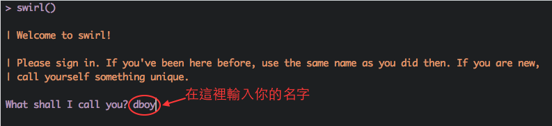
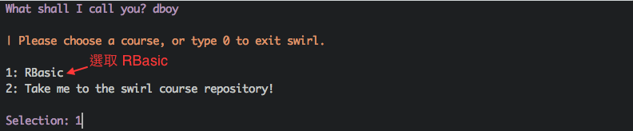
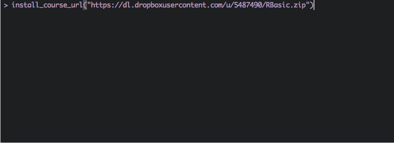
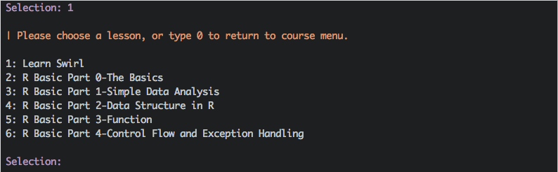

<!--######################################################################################-->
# Introduction
<!--######################################################################################-->

---

- 歡迎大家參加這次 DSC 2015 的 R Tutorial Workshop!

---

- 歡迎大家參加這次 DSC 2015 的 R Tutorial Workshop!
- 我們將會教導大家基本的資料分析技巧，包括資料整理 (ETL)、資料分析與資料視覺化等等。

---

- 歡迎大家參加這次 DSC 2015 的 R Tutorial Workshop!
- 我們將會教導大家基本的資料分析技巧，包括資料整理 (ETL)、資料分析與資料視覺化等等。
- 在這次的 workshop ，都是使用 swirl 這個 R 的互動式教學套件。

---

- 歡迎大家參加這次 DSC 2015 的 R Tutorial Workshop!
- 我們將會教導大家基本的資料分析技巧，包括資料整理 (ETL)、資料分析與資料視覺化等等。
- 在這次的 workshop ，都是使用 swirl 這個 R 的互動式教學套件。
- 跟 R 不熟? 跟 swirl 更不熟? 沒關係，我們會帶領大家一步一步使用 R 與 swirl 套件。

---

- 歡迎大家參加這次 DSC 2015 的 R Tutorial Workshop!
- 我們將會教導大家基本的資料分析技巧，包括資料整理 (ETL)、資料分析與資料視覺化等等。
- 在這次的 workshop ，都是使用 swirl 這個 R 的互動式教學套件。
- 跟 R 不熟? 跟 swirl 更不熟? 沒關係，我們會帶領大家一步一步使用 R 與 swirl 套件。
- OK! let the journey begin!

# Learn Swirl

---

- 請輸入 `library("swirl")`

---

- 請輸入 `library("swirl")`
- 執行 `swirl()` 進入互動教學模式。

---

- 請輸入 `library("swirl")`
- 執行 `swirl()` 進入互動教學模式。
- 遵照指令，你應該會看到:

---

- 如果課程有安裝成功，你應該可以看到:

---

- 如果課程有安裝成功，你應該可以看到:

 
（如果這時候想跳出，可以輸入 0 。）

---

- 如果沒有看到 `DSC2015` ，可以輸入下列指令進行安裝。

---

- 如果看到以下畫面，就成功進入 R Basic 互動課程選單!

---

- 如果看到以下畫面，就成功進入 R Basic 互動課程選單!

- 選取 `Learn Swirl` 一節開始吧!

# Before Move on Next Step

---

- 簡單總結一下剛剛學會的基本指令。

---

- 簡單總結一下剛剛學會的基本指令。
- `+`, `-`, `*`, `/` 可用於一般數值的加減乘除，須注意使用這些運算符於邏輯值的情況。

---

- 簡單總結一下剛剛學會的基本指令。
- `+`, `-`, `*`, `/` 可用於一般數值的加減乘除，須注意使用這些運算符於邏輯值的情況。
- `%%` 用於求餘數，`%/%` 用於求商。

---

- 簡單總結一下剛剛學會的基本指令。
- `+`, `-`, `*`, `/` 可用於一般數值的加減乘除，須注意使用這些運算符於邏輯值的情況。
- `%%` 用於求餘數，`%/%` 用於求商。
- `^` 用於計算冪級。

---

- 簡單總結一下剛剛學會的基本指令。
- `+`, `-`, `*`, `/` 可用於一般數值的加減乘除，須注意使用這些運算符於邏輯值的情況。
- `%%` 用於求餘數，`%/%` 用於求商。
- `^` 用於計算冪級。
- (Important!) 碰到問題可以用 `?` 與 `??` 查詢文件。

## Swirl Cheat Sheet

|   函數名   |            說明             |
|------------|-----------------------------|
|   `info`   | 列出 `swirl` 中可用的函式。 |
|   `skip`   | 跳至下一題。                |
|   `play`   | 暫時跳出 `swirl`。          |
|   `nxt`    | 跳回 `swirl`。              |
|   `bye`    | 結束 `swirl`。              |
|   `main`   | 跳至 `swirl` 主目錄區。     |

**Note**: 以上指令要在 `swirl` 中時看到 `>` 時才能使用。

# What's Next?

---

### Ning Chen

- Data Structure in R

---

### Ning Chen

- Data Structure in R
- Basic Data Analysis with R

---

### Noah

- User-Defined Function

---

### Noah

- User-Defined Function
- Control Flow and Exception Handling

# Q / A
